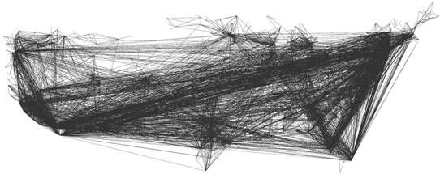
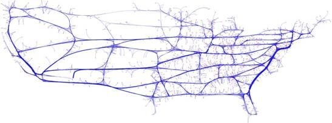
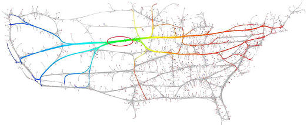

# Edge-Bundling
##系统配置要求:
- 操作系统: Windows 7以上
- CPU: Intel Core2 双核 2.8GHZ或 AMD 双核 3.0GHZ 以上
- 显卡：NVIDIA GTX780TI 
- 内存: 4G以上

 
##开发环境:
- 编程工具：VS2008
- 三维图形库： OSG3.0.1及OSGEarth2.2
- 着色语言：GLSL

 
##模块输入:
输入数据分别为需要进行边绑定处理的点线图数据和辅助绑定的公路数据。数据为float类型，点线图数据存储在.xml文件中，公路数据则存储在.shp文件中
 
##模块功能:
基于地理交通信息的边绑定在图布局之后根据一定的规则重新将一些边绑定成一束以减少图的混乱度，通过边绑定技术，若干满足条件的边被绑定成一束，大幅度降低图的复杂度，进而增强图的可读性和易理解性
 
##模块输出:
- 原始数据
 
  
 
- 边绑定处理后
 
 
 

